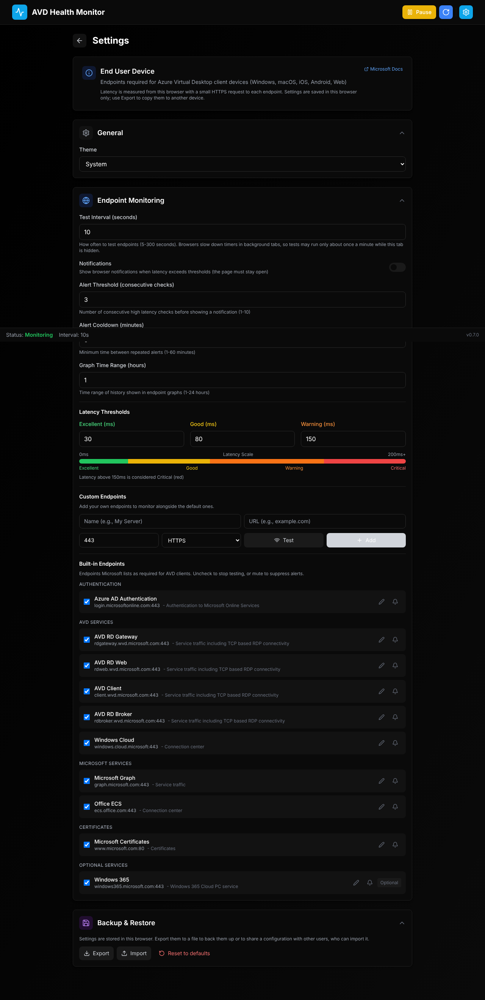

# AVD Health Monitor

A single web page that monitors, in real time, whether a client device can reach the Azure Virtual Desktop (AVD) endpoints it needs. Nothing to install: download one HTML file, double-click it, and it opens in your browser.

[](https://github.com/seb07-cloud/avd-health-monitor/actions)
[](LICENSE)

---

## Screenshots

### Settings



---

## Features

- **Required AVD client endpoints built in** - from [Microsoft's required FQDN list](https://learn.microsoft.com/en-us/azure/virtual-desktop/required-fqdn-endpoint) for Windows, macOS, iOS, Android and Web clients
- **Real-time latency monitoring** - configurable test interval (5-300 seconds)
- **Custom endpoints** - add your own hosts or URLs next to the defaults
- **Enable, disable or mute endpoints** - stop testing an endpoint, or keep testing it without alerts
- **Live graphs** - per-endpoint sparklines with a configurable time range (1-24 hours)
- **Status in the browser tab** - the tab icon changes color and the tab title shows the average latency
- **Browser notifications** - alert after N consecutive slow checks, with a cooldown between alerts
- **Themes** - Light, Dark, Nord, Cyberpunk, or follow the system
- **Saved in the browser** - settings and 24 hours of history survive page reloads
- **Export / Import** - copy a configuration to other users or devices as a JSON file

---

## Usage

1. Download `avd-health-monitor.html` from [Releases](https://github.com/seb07-cloud/avd-health-monitor/releases)
2. Double-click it. It opens in your default browser and starts testing right away.
3. Keep the tab open to keep monitoring.

The page is built for current versions of Edge and Chrome (tested in Chromium); other modern browsers should work too. You can also put the file on any web server or file share and send users the link.

### Status colors

| Status | Default range | Color |
|--------|---------------|-------|
| Excellent | 0-30ms | Green |
| Good | 31-80ms | Yellow |
| Warning | 81-150ms | Orange |
| Critical | >150ms | Red |

Endpoints that aren't latency-critical only show **Reachable** or **Unreachable**.

### Adding custom endpoints

1. Open **Settings** (gear icon)
2. Under **Custom Endpoints**, enter a **Name** and a hostname (`mygateway.example.com`) or a full URL (`https://example.com/health`)
3. Choose **HTTPS** or **HTTP** and the port
4. Click **Test** to check it, then **Add**

### Sharing a configuration

Settings are stored in the browser (`localStorage`), so each browser has its own copy. To set up several users the same way, configure one browser, use **Settings → Backup & Restore → Export**, and have the others **Import** the file. Settings files from the old desktop app can also be imported.

---

## How the measurement works

Browsers can't open raw TCP connections, so the page measures with web requests instead:

- Every test sends a tiny `HEAD` request to `https://<endpoint>/` (or `http://` for HTTP endpoints) in `no-cors` mode, with the cache disabled.
- Each test sends two requests. The first also pays for DNS, TCP and TLS setup; the second reuses the open connection and is close to the network round-trip time. The faster one is shown.
- An endpoint counts as reachable if the request completes, whatever the HTTP status. It is unreachable if the request fails (DNS, connection refused, TLS error, blocked by a proxy or firewall) or takes longer than 5 seconds.

This measures the network path the browser actually uses, including any proxy, which is also the path the AVD web client uses.

### Limitations

- **HTTP(S) only.** Endpoints that don't speak HTTP(S), such as raw TCP or SMB ports, can't be tested from a browser.
- **No error details.** Browsers hide why a request failed and which status code came back, so failures are reported as "Network error" or "Connection timed out".
- **Background tabs.** Browsers slow down timers in tabs that have been hidden for a while, so tests may run only about once a minute until you switch back.
- **Notifications** need the browser's permission. Some browsers refuse it for pages opened directly from a file; serve the page from a web server if you need notifications. The tab icon and title work either way.
- **No session host monitoring.** Session host mode, FSLogix storage checks, auto-start and log files needed the desktop app and were removed.

---

## Configuration

| Setting | Default | Description |
|---------|---------|-------------|
| Test Interval | 10 seconds | How often to test endpoints |
| Theme | System | Light/Dark/Nord/Cyberpunk/System |
| Notifications | Off | Browser notifications (asks for permission when turned on) |
| Alert Threshold | 3 checks | Consecutive slow checks before an alert |
| Alert Cooldown | 5 minutes | Minimum time between alerts |
| Graph Time Range | 1 hour | History shown in graphs |

### Built-in endpoints

| Endpoint | URL | Port | Purpose |
|----------|-----|------|---------|
| Azure AD Authentication | login.microsoftonline.com | 443 | Authentication |
| AVD RD Gateway | rdgateway.wvd.microsoft.com | 443 | RDP connectivity |
| AVD RD Web | rdweb.wvd.microsoft.com | 443 | Web access |
| AVD Client | client.wvd.microsoft.com | 443 | Client service |
| AVD RD Broker | rdbroker.wvd.microsoft.com | 443 | Connection broker |
| Windows Cloud | windows.cloud.microsoft | 443 | Connection center |
| Microsoft Graph | graph.microsoft.com | 443 | Service traffic |
| Office ECS | ecs.office.com | 443 | Connection center |
| Microsoft Certificates | www.microsoft.com | 80 | Certificates |
| Windows 365 (optional) | windows365.microsoft.com | 443 | Windows 365 Cloud PC service |

The list lives in [`src/data/endpoints.json`](src/data/endpoints.json) and is built into the page.

---

## Architecture

- React 19 + TypeScript 5
- TailwindCSS 3
- Recharts (graphs)
- Zustand (state, persisted to `localStorage`)
- Vite + [vite-plugin-singlefile](https://github.com/richardtallent/vite-plugin-singlefile), which inlines all JavaScript and CSS into one `index.html`. Browsers refuse to load separate script files from `file://` pages, so the page has to be a single file.

```
avd-health-monitor/
├── src/
│   ├── components/
│   │   ├── Dashboard.tsx          # Main monitoring view
│   │   ├── EndpointTile.tsx       # Compact endpoint tile
│   │   ├── SettingsPanel.tsx      # Configuration UI
│   │   └── ErrorBoundary.tsx      # Error handling wrapper
│   ├── data/
│   │   ├── endpoints.json         # Built-in AVD client endpoints
│   │   └── builtInEndpoints.ts    # Loads endpoints, applies user overrides
│   ├── hooks/
│   │   └── useStatusIndicator.ts  # Tab icon, title, notifications
│   ├── services/
│   │   └── latencyService.ts      # Browser latency probe
│   ├── store/
│   │   └── useAppStore.ts         # Global state (Zustand)
│   └── types.ts                   # TypeScript definitions
└── .github/workflows/ci.yml       # Test, build, release
```

---

## Development

Requires **Node.js** 22+ and **pnpm** 10+.

```bash
git clone https://github.com/seb07-cloud/avd-health-monitor.git
cd avd-health-monitor
pnpm install

# Dev server with hot reload (http://localhost:5173)
pnpm dev

# Build the single-file page -> dist/index.html
pnpm build

# Tests and type checking
pnpm test:run
pnpm exec tsc --noEmit
```

---

## Troubleshooting

### Every endpoint is unreachable
- Check that the device has internet access
- A proxy or firewall may block the requests; the page uses the browser's own proxy settings
- Open the browser's developer tools (F12) → Console for details

### Latency looks higher than expected
- The first test after opening the page includes connection setup; later tests are lower
- Traffic through a proxy or VPN adds its own delay, which the page includes on purpose

### Notifications don't appear
- Turn on **Notifications** in Settings and allow them when the browser asks
- If the browser refuses for a local file, serve the page from a web server
- Check that the operating system allows notifications from the browser

### Settings disappeared
- Settings are saved per browser. Clearing site data, or using a private window, removes them. Keep an exported copy.

---

## Contributing

See [CONTRIBUTING.md](CONTRIBUTING.md).

---

## License

This project is licensed under the MIT License - see [LICENSE](LICENSE) file for details.

---

## Acknowledgments

- Icons from [Lucide](https://lucide.dev/)
- Charts by [Recharts](https://recharts.org/)
- Endpoint documentation from [Microsoft Learn](https://learn.microsoft.com/en-us/azure/virtual-desktop/required-fqdn-endpoint)

---

<div align="center">

**Made for the AVD Community**

[Report Bug](https://github.com/seb07-cloud/avd-health-monitor/issues) | [Request Feature](https://github.com/seb07-cloud/avd-health-monitor/issues)

</div>
